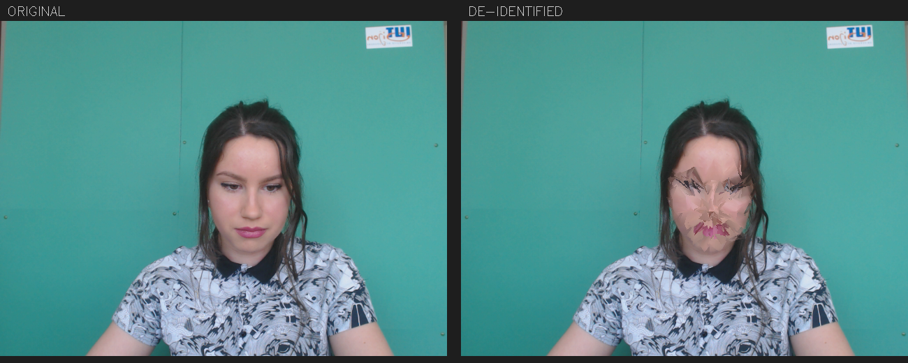
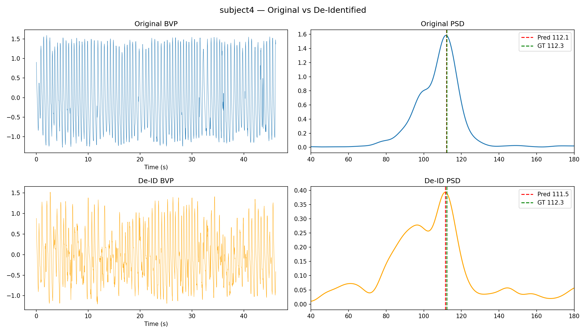

# ASTAR-X-NHG Face De-identification for rPPG

This repository contains a 3-stage pipeline for privacy-preserving remote Photoplethysmography (rPPG). The goal is to de-identify facial videos while preserving the physiological signals (heart rate) necessary for rPPG analysis.

## Pipeline Overview

1.  **Baseline rPPG Measurement**: Establishing accuracy on original, unmodified videos using the ME-rPPG model.
2.  **Geometric De-identification**: Distorting facial identity using MediaPipe FaceMesh landmarks and piecewise-affine warping.
3.  **Validation**: Verifying that the rPPG signal remains accurate even after significant geometric de-identification.

## Results

Experimental results on 3 subjects from the UBFC-rPPG dataset show that the de-identification process has **minimal impact** on utility.

| Metric | Original Video | De-Identified Video | Delta |
| :--- | :--- | :--- | :--- |
| **MAE (BPM)** | 2.94 | 3.12 | **+0.18** |
| **RMSE (BPM)** | 4.59 | 4.89 | +0.30 |
| **Pearson r** | 0.9596 | 0.9594 | -0.0002 |

### De-identification Visuals (Subject 1)
| Before (Original) | After (De-identified) |
| :---: | :---: |
|  | (See closeup below) |

#### Face Closeup Comparison

### rPPG Signal Comparison (Subject 4)
The graphs below show the extracted BVP signal and the Power Spectral Density (PSD) used for heart rate estimation.

## Usage

### Prerequisites
- Python 3.x
- `mediapipe`, `onnxruntime`, `opencv-python`, `numpy`, `scipy`, `matplotlib`

### Running the Pipeline
Run the following scripts in order:
1.  **Baseline**: `python scripts/run_baseline.py`
2.  **De-identify**: `python scripts/run_deidentify.py`
3.  **Validate**: `python scripts/run_validation.py`

## Methodology
- **Landmark Detection**: MediaPipe FaceMesh (468 landmarks).
- **De-id Method**: Deterministic geometric perturbation + Delaunay piecewise-affine warping.
- **rPPG Model**: ME-rPPG (Memory-efficient State Space Model).
- **HR Estimation**: Welch's Power Spectral Density.

## Acknowledgments
The core rPPG extraction logic is based on the [ME-rPPG repository](https://github.com/KegangWangCCNU/ME-rPPG).
